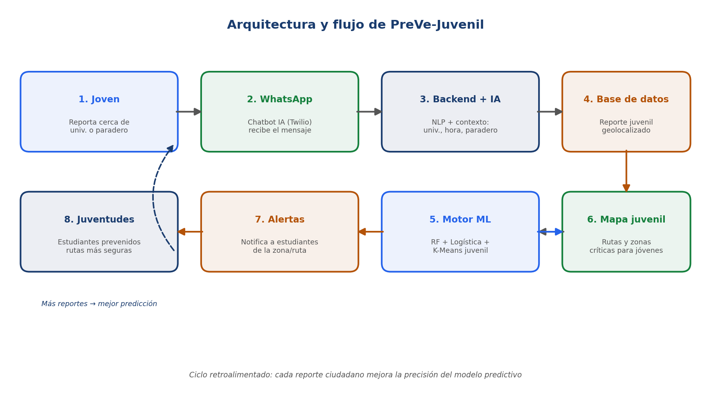
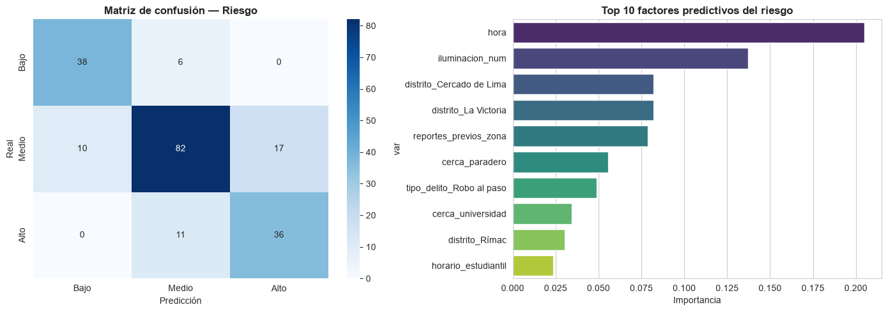
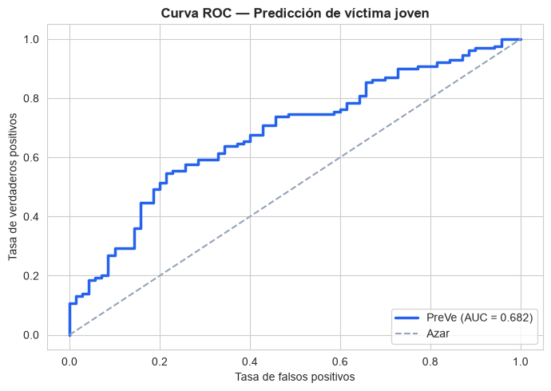
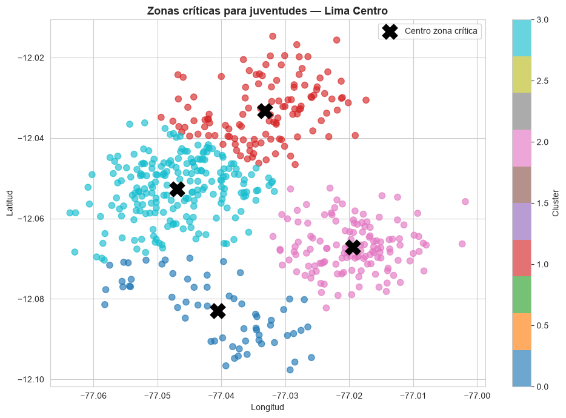
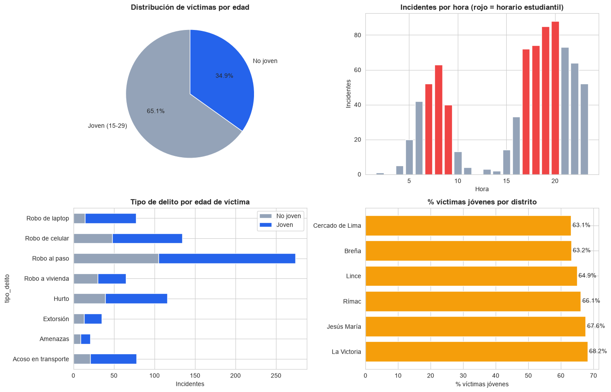

<div align="center">

# 🛡️ PreVe — Sistema Predictivo de Seguridad para Juventudes Urbanas

**Hackathon RedPública (PNUD) — Edición Seguridad Ciudadana**
Equipo **Minsky Devs** · Universidad Peruana de Ciencias Aplicadas (UPC)

<br>

[](https://fcarruitero24.github.io/preve-hackathon-redpublica/)

**[fcarruitero24.github.io/preve-hackathon-redpublica](https://fcarruitero24.github.io/preve-hackathon-redpublica/)**

<br>


</div>

---

## ¿Qué es PreVe?

PreVe es una plataforma ciudadana que **anticipa** zonas, rutas y horarios de
riesgo para jóvenes de 15 a 29 años en Lima Centro, transformando reportes
ciudadanos en alertas tempranas **antes** de que ocurra el delito.

Frente a las apps de seguridad existentes —reactivas y de público general— PreVe
combina tres atributos:

- **Predictivo, no reactivo.** Usa Machine Learning para anticipar el riesgo.
- **Enfocado en juventudes.** Alineado con el mandato del PNUD de protagonismo juvenil.
- **Sin fricción.** Funciona por WhatsApp, sin descargar ninguna app.

### El problema

- Solo el **16,1 %** de las víctimas de delito denuncia en el Perú (INEI, 2024).
  Ese subregistro impide diseñar prevención efectiva.
- En Lima Metropolitana, **18 de cada 100 personas** fueron víctimas de robo
  entre septiembre 2025 y febrero 2026 (INEI, 2026).
- Los jóvenes universitarios son blanco recurrente en sus trayectos cotidianos
  (universidad–paradero–trabajo), con casos documentados en la Universidad de
  Lima, PUCP, UTP y UCH.

---

## Arquitectura

<div align="center">

</div>

| Componente | Tecnología | Función |
|---|---|---|
| **Chatbot IA por WhatsApp** | Twilio API + NLP | Recibe reportes en lenguaje natural y extrae ubicación, hora y tipo de delito |
| **Plataforma web + mapa de calor** | React (PWA) + Google Maps API | Visualiza rutas y zonas críticas en tiempo real |
| **Motor predictivo de ML** | Python + scikit-learn | Random Forest, Regresión Logística y K-Means predicen riesgo y disparan alertas |

Cada reporte ciudadano alimenta al modelo: **más reportes → mejor predicción**.

---

## Resultados del prototipo

> Cifras medidas ejecutando [`notebooks/PreVe_Juvenil_ML.ipynb`](notebooks/PreVe_Juvenil_ML.ipynb)
> sobre los 800 incidentes del dataset. El notebook incluye todas las salidas.

### Modelo 1 — Random Forest: clasificar el nivel de riesgo

**Exactitud: 78,0 %** sobre 200 incidentes de prueba (3 clases: Bajo / Medio / Alto).

| Clase | Precisión | Recall | F1 | Casos |
|---|:--:|:--:|:--:|:--:|
| Bajo | 0,79 | 0,86 | 0,83 | 44 |
| Medio | 0,83 | 0,75 | 0,79 | 109 |
| Alto | 0,68 | 0,77 | 0,72 | 47 |

<div align="center">

</div>

**Los factores que más pesan son operativos, no demográficos:**

| Factor | Importancia |
|---|:--:|
| Hora del día | **20,5 %** |
| Iluminación de la zona | **13,7 %** |
| Distrito (Cercado de Lima) | 8,2 % |
| Distrito (La Victoria) | 8,2 % |
| Reportes previos en la zona | 7,9 % |
| Cercanía a paradero | 5,6 % |

Que hora e iluminación dominen es la señal más accionable del proyecto:
**son las dos variables sobre las que un municipio puede intervenir
directamente** —patrullaje por franja horaria y mantenimiento del alumbrado
público— sin necesidad de cambiar nada estructural.

### Modelo 2 — Regresión Logística: ¿la víctima será joven?

**AUC-ROC: 0,682** · exactitud 63,0 %

<div align="center">

</div>

| Clase | Precisión | Recall | F1 |
|---|:--:|:--:|:--:|
| No joven | 0,48 | 0,70 | 0,57 |
| Joven | 0,79 | 0,59 | 0,68 |

**Este es el modelo más débil del conjunto y conviene decirlo.** Un AUC de 0,682
está por encima del azar (0,5) pero lejos de ser fiable, y la precisión de 0,48
en la clase "No joven" significa que **cuando predice que la víctima no será
joven, acierta menos de la mitad de las veces**. Sirve como señal complementaria,
no como criterio de decisión.

### Modelo 3 — K-Means: zonas críticas para juventudes

<div align="center">

</div>

| Zona | Incidentes | Distrito principal | Hora promedio | % cerca de universidad |
|:--:|:--:|---|:--:|:--:|
| 3 | **207** | Cercado de Lima | 15:47 | 58,0 % |
| 2 | 134 | La Victoria | 15:42 | 53,0 % |
| 1 | 119 | Rímac | 15:46 | **60,5 %** |
| 0 | 61 | Lince | 15:42 | 47,5 % |

**Dos precisiones honestas sobre este resultado:**

1. **Las 4 zonas no fueron "detectadas", fueron pedidas.** El modelo se ejecuta
   con `n_clusters=4`, un parámetro fijado a mano. Un análisis riguroso
   determinaría el número óptimo con el método del codo o el de la silueta.
2. **El clustering es puramente geográfico.** Agrupa solo por latitud y
   longitud, así que las cuatro zonas comparten el mismo delito predominante
   (robo al paso) y prácticamente la misma hora promedio (~15:45). Separan
   *dónde*, no *cómo* ni *cuándo*.

Aun así el resultado es útil: identifica los cuatro focos geográficos donde
concentrar recursos, y confirma que **entre el 47 % y el 60 % de los incidentes
con víctimas jóvenes ocurren cerca de universidades**.

### Simulación de uso

El notebook cierra aplicando ambos modelos a un reporte nuevo —viernes 19:00,
La Victoria, iluminación deficiente, 7 reportes previos, cerca de universidad y
de paradero:

```
Nivel de riesgo predicho: 🔴 Alto
Probabilidad de afectar a un joven: 74 %
>> ACCIÓN: Alerta preventiva inmediata a estudiantes registrados en La Victoria.
```

---

## Análisis exploratorio

<div align="center">

</div>

---

## Estructura del repositorio

```
preve-hackathon-redpublica/
├── index.html                         ← demo interactiva (publicada en GitHub Pages)
├── notebooks/
│   ├── PreVe_Juvenil_ML.ipynb         ← los 3 modelos, con salidas incluidas
│   └── requirements.txt
├── data/
│   ├── incidentes_juvenil.csv         ← dataset sintético (800 incidentes)
│   ├── Datos_PreVe_Juvenil.xlsx       ← distritos, delitos, vulnerabilidad juvenil
│   ├── Datos_Lima_Centro.xlsx         ← denuncias, tipos de delito, victimización
│   └── Presupuesto_PreVe.xlsx         ← presupuesto detallado (8 hojas, S/ 10 000)
├── docs/                              ← documentos de la postulación (Word)
│   ├── Punto_A_Problema.docx
│   ├── Punto_B_Solucion.docx
│   ├── Anexo2_Puntos_B_C_E.docx
│   ├── Anexo_Analisis_Detallado.docx
│   └── Indice_Fuentes_Datos.docx
└── assets/                            ← diagrama y gráficos exportados
```

---

## Cómo usar cada parte

### Demo interactiva

**[Ábrela en el navegador](https://fcarruitero24.github.io/preve-hackathon-redpublica/)** —
no requiere instalación, cuenta ni conexión a ningún servicio externo. Incluye:

- Chat simulado de WhatsApp para reportar un incidente en lenguaje natural.
- Mapa de calor de Lima Centro con las zonas universitarias marcadas.
- Botón de **simulación automática** para ver el flujo completo sin escribir.
- Sistema de alertas que se dispara al acumular 3 reportes en una misma zona.

También puedes abrir `index.html` directamente tras clonar el repositorio.

### Notebook de Machine Learning

```bash
pip install -r notebooks/requirements.txt
jupyter notebook notebooks/PreVe_Juvenil_ML.ipynb
```

El notebook localiza el dataset automáticamente, así que corre igual desde
`notebooks/`, desde la raíz del repositorio o subiéndolo a Google Colab. Ya viene
con todas las salidas guardadas: **se puede leer en GitHub sin ejecutar nada**.

### Presupuesto

`data/Presupuesto_PreVe.xlsx` usa fórmulas nativas de Excel, sin macros. La
Hoja 1 es el resumen; las Hojas 2-6 el detalle por rubro; la Hoja 7 el
cronograma; la Hoja 8 la contrapartida y sostenibilidad.

---

## Sobre los datos

Los datos citados en la postulación provienen de fuentes oficiales: **INEI**
(Victimización en el Perú 2024/2025, Estadísticas de Criminalidad), **MININTER**
(Política Nacional Multisectorial de Seguridad Ciudadana al 2030), **CEPLAN** y
el **Observatorio del Crimen y la Violencia** (Credicorp/CHS, 2025).

> [!IMPORTANT]
> El dataset `incidentes_juvenil.csv` es **sintético**, calibrado con tendencias
> reales. Funciona como prueba de concepto del motor predictivo mientras se
> recolectan datos reales durante el piloto. Las métricas de esta página miden
> que el pipeline funciona, no el comportamiento real del delito en Lima.

Ver `docs/Indice_Fuentes_Datos.docx` para el listado completo de fuentes
descargables (DATACRIM, SIRTOD, Registro Nacional de Denuncias).

---

## Equipo — Minsky Devs

Cinco estudiantes de la UPC:

| Rol | Carrera |
|---|---|
| Líder de Proyecto + Data Scientist | Ingeniería Industrial |
| Tech Lead / Arquitecto | Ingeniería de Software |
| Backend Developer + Data Engineer | Ing. de Sistemas de Información |
| Frontend Developer + UX | Ing. de Sistemas de Información |
| QA + Encargado de Campo | Ing. de Sistemas de Información |

Repositorio mantenido por [Fabrizio Carruitero](https://github.com/fcarruitero24),
líder del proyecto.

---

## Licencia

Proyecto desarrollado con fines académicos y de postulación a la Hackathon
RedPública (PNUD), 2026. Uso educativo y de innovación social.
